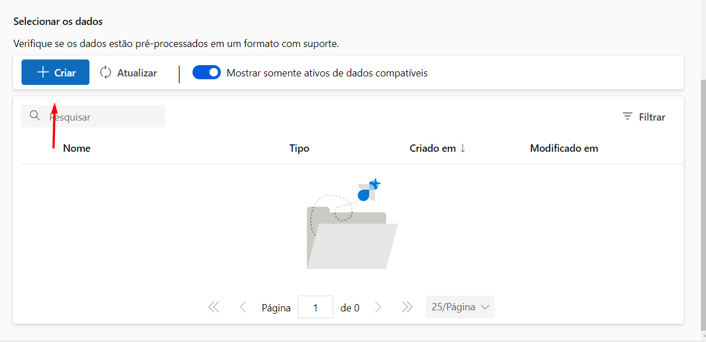
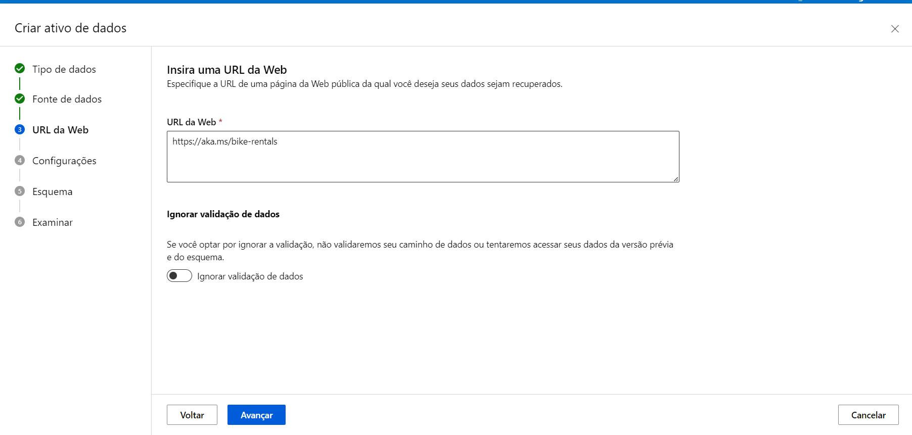
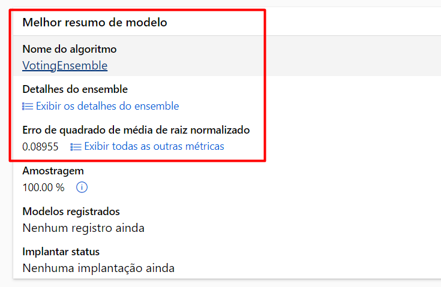

# AzureML_DIO_LabAI900
##
Autor: Rafael Henrique Ramos.

Data 12/02/2024.

Versão: V1.

##

## Links da Documentação:

[Azure Machine Learning](https://microsoftlearning.github.io/mslearn-ai-fundamentals/Instructions/Labs/01-machine-learning.html)

[Explore Azure AI Services](https://microsoftlearning.github.io/mslearn-ai-fundamentals/Instructions/Labs/02-content-safety.html)

## Descrição

Repositório para Entrega da atividade laboratorial do módulo de Introdução ao Aprendizado de Máquina.

## Desafio:

O desafio consiste em aprender e se familiarizar com o ambiente de desenvolvimento da Microsoft Azure, principalmente voltado para a parte de automatização de tarefas de Machine Learning.

Desse modo, criaremos um modelo de previsão com seus devidos pontos de extremidade configurados.

Detalharemos passo a passo nesse README.md

E junto com o arquivo.json, enviar dentro da plataforma da DIO, através do link do repositório no GitHub.


## Resolução do Desafio:

1 - ) **Para o desafio proposto primeiro é necessário logar com sua conta no [Portal Azure](https://portal.azure.com/)**.


2 - ) **Teremos que criar um novo recurso dentro da plataforma!**.


selecione a opção: + Create a Resource / + Criar um recurso.


Procure a opção de Machine Learning.


Ao selecionar a opção de criar, a seguinte tela aparecerá para você.


Na assinatura você irá colocar a assinatura da sua conta, o qual será feito a cobrança.

No grupo de recursos, recomendo criar um grupo o qual você irá colocar todos os seus desafios.

Logo após você pode colocar o nome do seu projeto e a região, é recomendado colocar a região East US, pois além de ser mais próxima a do Brasil, a cobrança de dados também será baixa.

Com relação das outras caixas, as mesmas serão preenchidas automaticamente após a definição do nome do projeto.
Não há necessidade de alteração nessa parte.

Após o preenchimento de todas as caixas, só clicar em "Examinar + Criar".

Com a validação aprovada, basta clicar em "Criar" e logo seguiremos para a próxima etapa.


Será necessário aguarda um tempo até a criação do workspace.

É recomendado ficar nessa tela até que a implementação esteja concluida.


Após finalizada a conclusão, basta clicar em "Ir para o recurso" e "Iniciar Estudio".


3 - ) **Verifique se você se encontra nessa página**.


Feito isso, clique em ML Automatizado.


Feito isso, agora iremos começar a criar o nosso modelo de Machine Learning.


Após clicar em "+ Novo trabalho de ML Automatizado", será mostrado uma nova tela com as configurações para inicializar o processo de Machine Learning Automatizado.


Dentro dessa tela, teremos várias etapas de configuração, mas iniciaremos com as configurações básicas.

3.1 - ) **Configurações Básicas de Identificação**.

Nelas devemos colocar o nome de identificação de nosso trabalho, do experimento e uma breve descrição o que será feito nesse trabalho.

Apenas para esclarecimento, esses nomes "mslearn-bike-automl" e "mslearn-bike-rental", são os nomes sugeridos pela documentação nesse primeiro contato com a plataforma.

As opções de Marcas poderão ser deixadas em branco nesse primeiro momento, portanto, basta clicar em avançar.


3.2 - ) **Criação da Base de Dados e a Tarefa a Ser Feita.**

Com relação a configuração do Tipo de Tarefas e Dados, primeiro é necessário analisar o que queremos prever no nosso trabalho para entender, dentre todos os modelos de trabalho, qual deverá ser usado.

No caso, queremos prever a quantidade de bicicletas que serão alugadas em um determinado dia com base no histórico de dados.

Portanto, a tarefa que será necessária é a de **Regressão**.


Feito isso, vamos importar a nossa base de dados.

3.2.1 - ) **Importando a Nossa Base de Dados**.

Primeiramente, clique na opção **Criar**, para criar uma nova base de dados.



Após isso, será necessário identificar a nova base de dados e determinar o seu tipo, o que no caso, será utilizado um tipo **Tabular**.

Após isso, clique em Avançar.


Nessa nova página, agora iremos de fato importar a nossa base de dados.

Como essa base de dados é uma base pública, iremos importa-la através de um link da web.

Portanto, selecione a opção **De Arquivos da Web** e clique em Avançar.


Dentro desse espaço, iremos colocar o link (https://aka.ms/bike-rentals) da base de dados e pode ignorar a validação de dados, ela não será necessária nesse momento.



Clique em avançar e aguarde um pouco até verificar se o link é válido.

3.2.2 - ) **Configurações da Base de Dados**

Vamos para a próxima etapa de configuração, ou seja, após ter importado a base de dados o qual será trabalhada.

Desse modo, aplicamos as seguintes configurações para trabalhar com essa base de dados (conforme orientado na documentação).


**Formato de Arquivo** -> Delimitado.

**Delimitador** -> Vírgula.

**Codificação** -> UTF-8.

**Cabeçalhos de Coluna** -> Somente o primeiro arquivo tem cabeçalhos. 

As configurações de **Ignorar Linhas** e **Conjuntos de dados com dados de várias linhas**, podem ser deixadas conforme o padrão. Em caso de dúvidas, só olhar a imagem acima.

3.2.3 - ) **Esquema**

Não há necessidade de muita alteração, apenas verificar se o **Path** está desmarcado.


Isso será importante caso queira ocultar uma coluna ou um conjunto de dados que não seja interessante de se realizar uma análise em cima, mas como não vem ao caso, só verifique a questão do **Path**.


3.2.4 - ) **Finalizando**

Ao final, será dado um resumo com todas as opções, se tiver tudo certo, só clicar em criar e aguardar o processo ser finalizado.


3.3 - ) **Configuração da Tarefa**

Agora que já realizamos a importação da base de dados a ser trabalhada, basta selecionar ela e clicar em avançar.


Nessa página, verifique o modelo selecionado e a base de dados para evitar qualquer problema, pois agora estaremos trabalhando com a configuração do modelo de Machine Learning.


Feito isso, vamos precisar selecionar a **Coluna de Destino**, que é referente a resposta que o nosso modelo deverá dar.

No caso, iremos selecionar a opção **rentals (Integer)**, pois queremos saber a quantidade de bicicletas.


Logo após, acesse a opção **Exibir definições de configurações adicionais**


Dentro dessa configuração, desmarque a primeira e a última caixa de seleção e verifica se a **Métrica Primária** é a **NormalizedRootMeanSquaredError**, conforme pode ser observado na figura abaixo.


Ainda nessa página de configuração, clique em **Modelos Permitidos** e selecione as opções de **Randon Forest** e **LightGBM**.


Salve as configurações e agora vamos trabalhar com o limite de nossos modelos.

3.3.1 - ) **Configurando os limites**

Vale a pena ressaltar que os valores a serem descritos aqui servem apenas para esse exemplo e que esses valores foram definidos conforme a documentação do projeto.


Em resumo, são parâmetros para controlar e otimizar o processo de treinamento de modelos, ajudando a definir como será feito a validação e quando o modelo deverá ser encerrado.


3.3.2 -) **Validar e Testar**

Nessas opções, iremos selecionar o tipo de validação a ser feito no modelo.

No caso, iremos selecionar o **Tipo de Validação** como **Divisão de Validação de Treinamento** e colocaremos em percentual de dados de 10.

Sobre o **Dados de Teste**, podemos deixar selecionado **Nenhum**.


4 - ) **Computação**

Sobre a configuração de processamento, podemos deixar como padrão as informações, conforme a imagem a seguir.


Verifque todas as informações necessárias e clique em **Enviar trabalho de Treinamento**


Na próxima tela, verifique o Status na parte de propriedades, quando estiver pronto, poderá ir para a próxima etapa do processo.


5 - ) **Análise dos Resultados**

Após isso, vamos para a análise dos resultados.

Inicialmente, a plataforma já mostra para nós qual foi o melhor modelo encontrado durante a execução.



No nosso caso foi o VotingEnsemble, podemos clicar em cima dele e ir para o próximo passo.


5.1 - ) **Analisando gráficos**

Clicando no nome do algoritmo, chegamos a uma nova página onde precisaremos ir para a aba de **Métricas**.


Nessa nova aba, vai ser mostrado todos os resultados obtidos pelo experimento.


Mas vamos dar enfoque no gráfico abaixo, o qual contém os valores do **predicted_true** e o **residuals**

caso não estejam aparecendo, verifique se eles estão selecionados na aba do lado chamada **Selecionar as Métricas**


Dentro desse gráfico é possível ter um *insight* de como está o nosso modelo, onde o valor da **linha pontilhada** é como se fosse o gabarito, ou seja, o valor real, enquanto a **linha contínua** é o valor preditivo do nosso modelo.

Podemos ver que ele teve um resultado satisfatório e portanto, podemos dar continuidade ao experimento.

6 - ) **Implantar e Testar o Modelo**

Dentro do nosso melhor modelo, vamos para a Aba **Modelo** e iremos fazer a implantação dele pela opção **Implantar** na página.


Dentro dela, iremos selecionar a Implementação por meio de um **Serviço Web**.


Você pode colocar o nome que quiser e a descrição, apenas se atente a selecionar a opção de **Instância de Contêiner do Azure** e em **Habilitar autenticação**.


Após isso, só clicar em **Implantar**.

Após isso, você pode verificar o estado de implementação no recurso de **Pontos de Extremidade**.


Feito isso, só aguardar a conclusão do serviço, que será concluída quando o status de implantação sair de *Running* para *succeeded*.

Essa ação pode levar de 5 a 10 minutos.


Após concluído, eles deverão aparecer assim:


6.1 - ) **Testando o Modelo**

Confirmado o status da implantação, agora iremos testar o nosso modelo. Para isso, primeiramente, vá para a aba **Testar**.


Será possível ver que, dentro dessa aba, temos a opção de inserir os dados ou parâmetros a serem testados, um botão **Testar** e a parte de resultados.


Dentro da documentação, ela nos dá alguns parâmetros que podem servir de teste.


```
 {
   "Inputs": { 
     "data": [
       {
         "day": 1,
         "mnth": 1,   
         "year": 2022,
         "season": 2,
         "holiday": 0,
         "weekday": 1,
         "workingday": 1,
         "weathersit": 2, 
         "temp": 0.3, 
         "atemp": 0.3,
         "hum": 0.3,
         "windspeed": 0.3 
       }
     ]    
   },   
   "GlobalParameters": 1.0
 }

```


Copie esse código e cole dentro da caixa editável, logo abaixo onde está escrito **"Inserir dados para teste de ponto de extremidade"**.

Desse modo:


Clique em testar e aguarde o resultado.

Verique se o resutado dará um valor aproximado a esse:


você também pode ir alterando alguns parametros a fim de comparar alguns resultados, como por exemplo comparar a quantidade de bicicletas alugadas em um dia sendo ou não feriado e sendo um dia de trabalho.

Você só precisa colocar uma virgula ao final do primeiro conjunto de dados e colar o novo conjunto com os valores alterados.

```
 {
   "Inputs": { 
     "data": [
       {
         "day": 1,
         "mnth": 1,   
         "year": 2022,
         "season": 2,
         "holiday": 0,
         "weekday": 1,
         "workingday": 1,
         "weathersit": 2, 
         "temp": 0.3, 
         "atemp": 0.3,
         "hum": 0.3,
         "windspeed": 0.3 
       },

       {
         "day": 1,
         "mnth": 1,   
         "year": 2022,
         "season": 2,
         "holiday": 1,
         "weekday": 1,
         "workingday": 0,
         "weathersit": 2, 
         "temp": 0.3, 
         "atemp": 0.3,
         "hum": 0.3,
         "windspeed": 0.3 
       }
     ]    
   },   
   "GlobalParameters": 1.0
 }
```

Resultado: 

O primeiro caso é para quando não se é um feriado e é um dia de trabalho.

O segundo é para quando é um feriado e não é um dia de trabalho.


##


## Excluindo meu projeto.

Por fim, após cada resolução dos desafios é recomendado excluir a sua tarefa, pois caso o contrário, ele irá ficar consumindo os créditos e poderá ocorrer cobranças adicionais.

Na própria documentação é recomendado fazer isso, então, apenas irei traduzir o que diz na documentação:


##

O serviço da web que você criou está hospedado em uma Instância de Contêiner do Azure. Se você não pretende experimentá-lo mais, deve excluir o ponto de extremidade para evitar a acumulação desnecessária de uso do Azure.


Passo a passo:
1. No Azure Machine Learning Studio, na guia **Pontos de Extremidade**, selecione o ponto de extremidade **predict-rentals** ou o nome que você colocou para o seu teste. 

2. Em seguida, selecione **Excluir** e confirme que deseja excluir o ponto de extremidade.


A exclusão do seu recurso de computação garante que sua assinatura não será cobrada por recursos de computação. No entanto, você será cobrado uma pequena quantia pelo armazenamento de dados enquanto o espaço de trabalho do Azure Machine Learning existir em sua assinatura. Se você terminou de explorar o Azure Machine Learning, pode excluir o espaço de trabalho do Azure Machine Learning e os recursos associados.


**Para excluir seu espaço de trabalho:**

1. No portal do Azure, na página **Grupos de recursos**, abra o grupo de recursos que você especificou ao criar seu espaço de trabalho do Azure Machine Learning.

2. Clique em **Excluir grupo de recursos**, digite o nome do grupo de recursos para confirmar que deseja excluí-lo e selecione Excluir.


